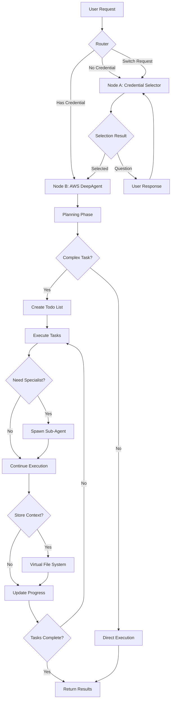

# AWS Agent (DeepAgent)

A LangGraph DeepAgent for autonomous AWS problem-solving, part of the Planton Cloud Agent Fleet.

## Overview

The AWS Agent is built using the [DeepAgents](https://github.com/langchain-ai/deepagents) framework, which enables it to autonomously plan and execute complex AWS tasks. Unlike simple conversational agents, this DeepAgent can break down problems, spawn specialized sub-agents, and maintain context across long-running operations.

## Project Structure

```
aws_agent/
├── __init__.py              # Package exports and imports
├── configuration.py         # Agent configuration and settings
├── state.py                # Extended state with credential management
├── graph.py                # Main graph orchestration
├── llm.py                  # LLM provider configuration
├── mcp/                    # MCP integration package
│   ├── __init__.py         # Package exports
│   ├── client_manager.py   # MCP client lifecycle management
│   ├── config.py           # Configuration and environment setup
│   ├── planton.py          # Planton Cloud MCP integration
│   ├── aws.py              # AWS API MCP integration
│   ├── tools.py            # Tool combination logic
│   └── README.md           # MCP package documentation
├── nodes/                  # Graph nodes (modular architecture)
│   ├── __init__.py
│   ├── credential_selector.py  # Node A: Credential selection & logic
│   ├── aws_deepagent.py       # Node B: AWS operations
│   ├── router.py              # Routing logic
│   └── CREDENTIAL_SWITCHING.md # Credential switching details
├── utils/                  # Utilities
│   ├── __init__.py
│   └── session.py          # Session management
├── subagents/              # Specialized sub-agents
│   ├── __init__.py
│   └── ecs_troubleshooter.py
└── README.md               # This documentation
```

## DeepAgent Architecture

### What Makes This a "Deep" Agent?

Based on LangChain's DeepAgents framework, our AWS agent implements four key capabilities:

1. **🎯 Planning Tool**
   - Breaks complex tasks into manageable todo items
   - Tracks progress and dependencies
   - Maintains focus on long-running operations

2. **🤖 Sub-Agents**
   - Spawns specialized agents for specific tasks:
     - `ecs_troubleshooter`: Deep dives into ECS issues
     - `cost_optimizer`: Analyzes and reduces AWS costs
     - `security_auditor`: Reviews security configurations
   - Each sub-agent has focused expertise and instructions

3. **📁 Virtual File System**
   - Stores investigation findings and intermediate results
   - Maintains context across multiple steps
   - Enables collaboration between sub-agents

4. **📜 Detailed System Prompt**
   - Comprehensive instructions with specific methodologies
   - Examples and best practices built-in
   - Guides autonomous problem-solving behavior

### Two-Node Architecture

The AWS Agent implements a two-node flow for secure credential management:



#### Node A: Credential Selector
- Uses Planton MCP tools only
- Lists available AWS credentials
- Auto-selects if single credential
- Asks clarifying question if multiple
- Detects switch/clear intents

#### Node B: AWS DeepAgent
- Mints STS credentials
- Combines Planton + AWS MCP tools
- Executes DeepAgent with full AWS access
- Handles planning, sub-agents, and file system

## Core Components

### 1. State Management (`state.py`)
Extended DeepAgentState with credential tracking:
- `selectedCredentialId`: Current AWS credential
- `selectedCredentialSummary`: Non-secret credential info
- `stsExpiresAt`: STS expiration tracking
- `selectionVersion`: Change tracking
- Session context (orgId, envId, actorToken)

### 2. Graph Orchestration (`graph.py`)
Main entry point with modular architecture:
- Creates two-node StateGraph
- Configures routing logic
- Manages session lifecycle
- Provides both LangGraph Studio and CLI interfaces

### 3. Node Components (`nodes/`)
Modular graph nodes for separation of concerns:
- **credential_selector.py**: Node A implementation
- **aws_deepagent.py**: Node B implementation  
- **router.py**: Conditional routing logic

### 4. Credential Selection (`nodes/credential_selector.py`)
LLM-based credential selection logic and node implementation:
- Contains both selection logic and Node A implementation
- Lists credentials via Planton MCP
- Detects switch/clear intents
- Returns structured selection response
- Handles ambiguous cases with questions

### 5. MCP Integration (`mcp/` package)
Modular MCP integration with session-scoped management:
- **client_manager.py**: MCPClientManager for lifecycle management
- **config.py**: Environment setup and project root detection
- **planton.py**: Planton Cloud MCP integration
- **aws.py**: AWS API MCP integration with STS minting
- **tools.py**: Tool combination and caching logic
- Automatic STS refresh before expiration
- See [MCP package documentation](mcp/README.md) for details

### 6. Session Management (`utils/session.py`)
Handles session-scoped data:
- MCP client instances
- Agent cache by credential
- Configuration storage
- Clean shutdown hooks

### 7. Sub-agents (`subagents/`)
Specialized DeepAgent extensions:
- **ecs_troubleshooter.py**: ECS debugging specialist

## MCP (Model Context Protocol) Integration

The AWS Agent uses MCP to dynamically load tools from default MCP servers, following the [LangChain MCP integration pattern](https://langchain-ai.github.io/langgraph/agents/mcp/).

### Default MCP Servers

The agent automatically connects to these two MCP servers:

1. **Planton Cloud MCP Server**
   - AWS credential management through platform integration
   - Platform-specific tools and utilities

2. **AWS API MCP Server** 
   - From [awslabs/mcp](https://github.com/awslabs/mcp)
   - Provides virtually the entire AWS CLI surface
   - Covers list, describe, create operations across all AWS services
   - No custom abstractions - direct AWS API access

### Why MCP?

- **Comprehensive Coverage**: AWS API MCP provides access to all AWS services
- **No Abstraction**: Tools come directly from MCP servers, no wrapper code
- **Dynamic Loading**: Tools are loaded at runtime, always up-to-date
- **Standard Protocol**: Follows the Model Context Protocol standard

### How It Works

```python
# In LangGraph Studio, the agent automatically loads tools from both MCP servers
# Tools are available when you interact through the Studio UI:
# - Planton Cloud tools for credentials
# - AWS API tools for all AWS operations

# Example interaction in Studio:
"List my EC2 instances"
```

**Note**: Future releases will add customization options for MCP servers and tool filtering.

## LangGraph Studio Integration

### Configuration

The agent is now simplified for LangGraph Studio deployment. Configure through the Studio UI:

```json
{
  "model_name": "gpt-4o",           // LLM model selection
  "temperature": 0.7,               // Response creativity (0.0-1.0)
  "instructions": "Custom prompt",  // Override default instructions
  "max_retries": 3,                // Retry limit for operations
  "max_steps": 20,                 // Maximum execution steps
  "recursion_limit": 50,           // Max graph cycles (super-steps) - critical for DeepAgents
  "timeout_seconds": 600           // Operation timeout
}
```

### Entry Points

The agent provides two entry points for different use cases:

1. **`graph(config: dict)`** - For LangGraph Studio deployment
   - Called directly by LangGraph Studio
   - Accepts configuration as a dictionary
   - Async function that works within Studio's event loop

2. **`create_aws_agent(...)`** - For examples and CLI demos
   - Wrapper function for standalone use
   - Accepts typed configuration objects
   - Perfect for quick demos and testing

### Recent Changes (December 2024)

1. **Two-Node Architecture**: Implemented credential selection (Node A) and AWS execution (Node B)
2. **Credential Switching**: Dynamic AWS account switching mid-conversation
3. **Smart Selection**: Auto-selects single credential or asks clarifying questions
4. **Modular Structure**: Reorganized into nodes/, utils/ for better maintainability
5. **Session Management**: Isolated sessions for multi-tenant safety
6. **STS Refresh**: Automatic credential refresh before expiration
7. **No-Credential Handling**: Graceful first-turn credential selection
8. **MCP Package Refactoring**: Split `mcp_integration.py` into a clean package structure with separate modules for client management, configuration, and provider-specific logic

## Usage Examples

### Quick Start with Make Commands

```bash
# Prerequisites: Set up environment
export OPENAI_API_KEY="your-key"
export ANTHROPIC_API_KEY="your-key"  # Optional

# From root directory
make venvs           # Install dependencies
make aws-examples    # Run interactive examples menu

# Or run specific examples
make aws-example-1   # Generic AWS assistant
make aws-example-2   # Complex ECS debugging
# ... (see make help for all options)

# Start LangGraph Studio for interactive development
make run
```

### Basic Usage in LangGraph Studio

In LangGraph Studio, the agent handles credential selection automatically:

```python
# First turn - no credential context
"List my EC2 instances"

# Agent response (if multiple credentials):
"Which AWS account: Production (123456789012), Staging (987654321098)?"

# User specifies:
"Use production"

# Agent proceeds with production account...

# Later, user can switch:
"Switch to staging account and show RDS databases"

# Agent switches credentials and executes in staging
```

### Basic Usage for CLI Demos

For quick demos and testing outside of LangGraph Studio:

```python
from src.agents.aws_agent import create_aws_agent, AWSAgentState, cleanup_session
from langchain_core.messages import HumanMessage

# Create agent with organization context
agent = await create_aws_agent(
    org_id="my-org",
    model_name="gpt-4o",
    runtime_instructions="Focus on cost optimization"
)

# First turn - credential selection happens automatically
state = AWSAgentState(
    messages=[HumanMessage(content="Analyze my EC2 costs")],
    orgId="my-org"
)
result = await agent.ainvoke(state)

# Switch accounts mid-conversation
result['messages'].append(
    HumanMessage(content="Switch to production and check RDS costs")
)
result = await agent.ainvoke(result)

# Clean up when done
await cleanup_session()
```

### Observing Agent Planning

The agent will automatically:
1. Create a todo list for the debugging process
2. Fetch AWS credentials
3. Analyze the error
4. Potentially spawn the ECS troubleshooter sub-agent
5. Store findings in virtual file system
6. Provide step-by-step resolution

### Custom Configuration in LangGraph Studio

Configure through the Studio UI configuration panel:

```json
{
  "model_name": "gpt-4o",
  "temperature": 0.3,
  "max_steps": 30,         // Allow more steps for complex tasks
  "timeout_seconds": 900   // Longer timeout for complex operations
}
```

### Working with Sub-Agents

Sub-agents are automatically spawned when needed for specialized tasks:

```python
# This will likely spawn the ECS troubleshooter sub-agent
result = agent.invoke({
    "messages": [HumanMessage(content="""
    My ECS service is failing with task placement errors.
    Debug the issue and provide solutions.
    """)]
})
```

## Sub-Agent Specialization

### ECS Troubleshooter
The agent includes a specialized ECS troubleshooter sub-agent that handles:
- Task failure analysis
- Container exit debugging
- Service deployment issues
- Load balancer health checks
- Resource constraints and placement issues
- Network configuration problems

## Virtual File System

The agent uses a virtual file system to:

```
/investigation/
  findings.md          # Key discoveries
  error_analysis.txt   # Detailed error breakdown
  recommendations.md   # Proposed solutions

/architecture/
  current_state.yaml   # Current architecture
  proposed_changes.md  # Recommended changes

/costs/
  analysis.csv        # Cost breakdown
  savings_plan.md     # Optimization strategy
```

## Advanced Features

### Planning Example

When given a complex task, the agent creates a todo list:

```
TODO List:
[ ] Fetch AWS credentials
[ ] Analyze ECS service configuration
[ ] Check CloudWatch logs for container exits
[ ] Review task definition for issues
[ ] Examine resource constraints
[ ] Test proposed fixes
[x] Document findings
```

### Context Persistence

The virtual file system maintains context:

```python
# First interaction
"Debug my ECS service deployment issues"
# Agent stores findings in virtual FS

# Later interaction  
"What were the main issues you found?"
# Agent retrieves context from virtual FS
```

### Autonomous Problem Solving

The agent can work autonomously on complex tasks:

```python
# This triggers multi-step autonomous work
"Perform a security audit of my AWS account and create a remediation plan"

# Agent will:
# 1. Plan the audit scope
# 2. Spawn security_auditor sub-agent
# 3. Store findings systematically
# 4. Create actionable remediation plan
```

## Integration with Planton Cloud

### Assistant Creation

Users create specialized assistants via:
- Web console with DeepAgent configuration
- Custom instructions for specific use cases
- Sub-agent selection and customization

### Execution Monitoring

Track agent progress through:
- Todo list updates
- Sub-agent spawning events
- Virtual file system changes
- Streaming progress updates

## Development

### Running Examples

#### Using Make Commands (Recommended)

```bash
# From the root directory, run interactive examples menu
make aws-examples

# Or run specific examples
make aws-example-1    # Generic AWS assistant
make aws-example-2    # Complex ECS debugging (planning + sub-agents)
make aws-example-3    # AWS solutions architect
make aws-example-4    # Agent with specific region
make aws-example-5    # Custom instructions agent
make aws-example-6    # AWS operations with MCP
make aws-example-all  # Run all examples sequentially

# From the aws_agent directory directly
cd src/agents/aws_agent
make examples         # Show examples menu
make example-1        # Run specific example
```

#### Manual Installation and Running

```bash
# Install dependencies including deepagents
make venvs  # From root directory

# Or manually:
pip install deepagents langchain-openai

# Run example directly
python examples/aws_agent_example.py
```

### Testing Planning Behavior in LangGraph Studio

Test complex task planning through the Studio UI:

```
Input:
"1. Audit my S3 buckets for public access
2. Review IAM policies for overly permissive access  
3. Check EC2 instances for unencrypted volumes
4. Create a security remediation plan"

# The agent handles AWS credentials automatically via MCP

# Observe todo list creation and systematic execution in the Studio interface
```

## Limitations and Considerations

1. **Complexity vs Speed**: Deep agents take more time but provide thorough solutions
2. **Token Usage**: Planning and sub-agents increase token consumption
3. **State Management**: Virtual file system is ephemeral per session
4. **Sub-Agent Coordination**: Complex multi-agent scenarios need careful orchestration

## Future Enhancements

1. **Persistent File System**
   - Store findings across sessions
   - Build knowledge base over time

2. **Custom Sub-Agents**
   - User-defined specialist agents
   - Industry-specific agents (FinTech, HealthTech)

3. **Tool Integration**
   - Direct AWS SDK integration
   - CloudFormation/Terraform generation
   - Real-time AWS resource queries

4. **Collaborative Features**
   - Multi-agent collaboration
   - Human-in-the-loop approvals
   - Audit trails for compliance

## Troubleshooting

### Agent Not Planning
- Ensure `enable_planning=True` in config
- Check task complexity (simple tasks may not need planning)
- Verify model supports function calling

### Sub-Agents Not Spawning
- Confirm `enable_subagents=True`
- Check if task matches sub-agent specialization
- Review agent decision-making in logs

### Virtual FS Issues
- Ensure `enable_file_system=True`
- Check state persistence configuration
- Verify sufficient context window

### GraphRecursionError: "Recursion limit reached"
- **Cause**: The agent needs more graph cycles to complete complex tasks
- **Default**: `recursion_limit=50` (increased from LangGraph's default of 25)
- **For complex tasks**: Increase to 100-200 for tasks involving:
  - Multiple planning iterations
  - Spawning several sub-agents
  - Complex troubleshooting with many tool calls
  - Long-running investigations
- **Configuration**: Set in LangGraph Studio UI or via config:
  ```json
  {
    "recursion_limit": 100  // Adjust based on task complexity
  }
  ```
- **Note**: This is NOT about retry attempts, but graph execution cycles

## Contributing

To enhance the AWS DeepAgent:

1. **Add Sub-Agents**: Create new specialists in `graph.py`
2. **Extend Tools**: Add AWS-specific tools for common operations
3. **Improve Planning**: Enhance todo list strategies
4. **Document Patterns**: Share successful agent patterns

## License

Part of Planton Cloud Agent Fleet - see repository LICENSE file.