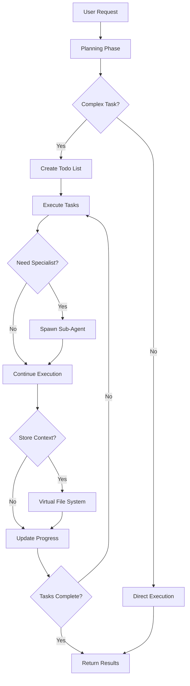

# AWS Agent (DeepAgent)

A LangGraph DeepAgent for autonomous AWS problem-solving, part of the Planton Cloud Agent Fleet.

## Overview

The AWS Agent is built using the [DeepAgents](https://github.com/langchain-ai/deepagents) framework, which enables it to autonomously plan and execute complex AWS tasks. Unlike simple conversational agents, this DeepAgent can break down problems, spawn specialized sub-agents, and maintain context across long-running operations.

## Project Structure

```
aws_agent/
├── __init__.py              # Package exports and imports
├── configuration.py         # Agent configuration and settings
├── graph.py                # Main agent orchestration (simplified for LangGraph Studio)
├── llm.py                  # LLM provider configuration
├── mcp_integration.py      # MCP server integration
├── README.md               # This documentation
└── subagents/              # Specialized sub-agents
    ├── __init__.py
    └── ecs_troubleshooter.py
```

## DeepAgent Architecture

### What Makes This a "Deep" Agent?

Based on LangChain's DeepAgents framework, our AWS agent implements four key capabilities:

1. **🎯 Planning Tool**
   - Breaks complex tasks into manageable todo items
   - Tracks progress and dependencies
   - Maintains focus on long-running operations

2. **🤖 Sub-Agents**
   - Spawns specialized agents for specific tasks:
     - `ecs_troubleshooter`: Deep dives into ECS issues
     - `cost_optimizer`: Analyzes and reduces AWS costs
     - `security_auditor`: Reviews security configurations
   - Each sub-agent has focused expertise and instructions

3. **📁 Virtual File System**
   - Stores investigation findings and intermediate results
   - Maintains context across multiple steps
   - Enables collaboration between sub-agents

4. **📜 Detailed System Prompt**
   - Comprehensive instructions with specific methodologies
   - Examples and best practices built-in
   - Guides autonomous problem-solving behavior

### Agent Flow



## Core Components

### 1. Configuration (`configuration.py`)
Simple configuration focused on essentials:
- Model name and temperature
- Custom instructions (optional)
- Execution limits (retries, steps, timeout)
- Planning, sub-agents, and file system are enabled by default

### 2. Graph (`graph.py`)
Main orchestration module (simplified for LangGraph Studio):
- Single async `graph()` function for LangGraph Studio
- Assembles MCP tools and sub-agents
- Creates DeepAgent instances with full configuration support
- Ensures dev/prod parity with MCP tools

### 3. LLM Module (`llm.py`)
Handles language model configuration:
- Supports OpenAI and Anthropic models
- Model-specific settings
- Provider detection and fallbacks

### 4. MCP Integration (`mcp_integration.py`)
Dynamic tool loading through Model Context Protocol:
- **Planton Cloud MCP Server**: Platform tools and AWS credential management
- **AWS API MCP Server**: Complete AWS CLI surface (list, describe, create operations across all services)
- Tools are loaded dynamically at runtime from both servers

### 5. Sub-agents Package (`subagents/`)
Specialized sub-agent for deep ECS expertise:
- **ecs_troubleshooter.py**: ECS service and container debugging specialist

## MCP (Model Context Protocol) Integration

The AWS Agent uses MCP to dynamically load tools from default MCP servers, following the [LangChain MCP integration pattern](https://langchain-ai.github.io/langgraph/agents/mcp/).

### Default MCP Servers

The agent automatically connects to these two MCP servers:

1. **Planton Cloud MCP Server**
   - AWS credential management through platform integration
   - Platform-specific tools and utilities

2. **AWS API MCP Server** 
   - From [awslabs/mcp](https://github.com/awslabs/mcp)
   - Provides virtually the entire AWS CLI surface
   - Covers list, describe, create operations across all AWS services
   - No custom abstractions - direct AWS API access

### Why MCP?

- **Comprehensive Coverage**: AWS API MCP provides access to all AWS services
- **No Abstraction**: Tools come directly from MCP servers, no wrapper code
- **Dynamic Loading**: Tools are loaded at runtime, always up-to-date
- **Standard Protocol**: Follows the Model Context Protocol standard

### How It Works

```python
# In LangGraph Studio, the agent automatically loads tools from both MCP servers
# Tools are available when you interact through the Studio UI:
# - Planton Cloud tools for credentials
# - AWS API tools for all AWS operations

# Example interaction in Studio:
"List my EC2 instances"
# With state: {"aws_credential_id": "aws-cred-123"}
```

**Note**: Future releases will add customization options for MCP servers and tool filtering.

## LangGraph Studio Integration

### Configuration

The agent is now simplified for LangGraph Studio deployment. Configure through the Studio UI:

```json
{
  "model_name": "gpt-4o",           // LLM model selection
  "temperature": 0.7,               // Response creativity (0.0-1.0)
  "instructions": "Custom prompt",  // Override default instructions
  "max_retries": 3,                // Retry limit for operations
  "max_steps": 20,                 // Maximum execution steps
  "timeout_seconds": 600           // Operation timeout
}
```

### Entry Points

The agent provides two entry points for different use cases:

1. **`graph(config: dict)`** - For LangGraph Studio deployment
   - Called directly by LangGraph Studio
   - Accepts configuration as a dictionary
   - Async function that works within Studio's event loop

2. **`create_aws_agent(...)`** - For examples and CLI demos
   - Wrapper function for standalone use
   - Accepts typed configuration objects
   - Perfect for quick demos and testing

### Recent Changes (December 2024)

1. **Simplified graph.py**: Main `graph()` function for LangGraph Studio
2. **Added create_aws_agent**: Restored for examples and CLI demos
3. **Fixed async issues**: Resolved `asyncio.run()` error in event loop context
4. **Removed gRPC server**: Focusing on LangGraph Studio integration first
5. **Dev/prod parity**: MCP tools now available in both environments

## Usage Examples

### Basic Usage in LangGraph Studio

In LangGraph Studio, the agent is automatically instantiated with your configuration:

```python
# The graph function is called by LangGraph Studio with your config
# You interact through the Studio UI, not directly in code

# Example input in Studio:
"My ECS service is failing to deploy. Tasks keep stopping with 
'Essential container exited' error. Can you help me debug and fix this?"

# Provide state variables:
{
  "aws_credential_id": "aws-cred-123"
}
```

### Basic Usage for CLI Demos

For quick demos and testing outside of LangGraph Studio:

```python
from src.agents.aws_agent import create_aws_agent
from langchain_core.messages import HumanMessage

# Create agent for demo
agent = await create_aws_agent(
    model_name="gpt-4o",
    runtime_instructions="Focus on cost optimization"
)

# Use the agent
result = await agent.invoke({
    "messages": [HumanMessage(content="Analyze my EC2 costs")],
    "aws_credential_id": "aws-cred-123"
})

print(result["messages"][-1].content)
```

### Observing Agent Planning

The agent will automatically:
1. Create a todo list for the debugging process
2. Fetch AWS credentials
3. Analyze the error
4. Potentially spawn the ECS troubleshooter sub-agent
5. Store findings in virtual file system
6. Provide step-by-step resolution

### Custom Configuration in LangGraph Studio

Configure through the Studio UI configuration panel:

```json
{
  "model_name": "gpt-4o",
  "temperature": 0.3,
  "max_steps": 30,         // Allow more steps for complex tasks
  "timeout_seconds": 900   // Longer timeout for complex operations
}
```

### Working with Sub-Agents

Sub-agents are automatically spawned when needed for specialized tasks:

```python
# This will likely spawn the ECS troubleshooter sub-agent
result = await agent.invoke({
    "messages": [HumanMessage(content="""
    My ECS service is failing with task placement errors.
    Debug the issue and provide solutions.
    """)],
    "aws_credential_id": "aws-cred-123"
})
```

## Sub-Agent Specialization

### ECS Troubleshooter
The agent includes a specialized ECS troubleshooter sub-agent that handles:
- Task failure analysis
- Container exit debugging
- Service deployment issues
- Load balancer health checks
- Resource constraints and placement issues
- Network configuration problems

## Virtual File System

The agent uses a virtual file system to:

```
/investigation/
  findings.md          # Key discoveries
  error_analysis.txt   # Detailed error breakdown
  recommendations.md   # Proposed solutions

/architecture/
  current_state.yaml   # Current architecture
  proposed_changes.md  # Recommended changes

/costs/
  analysis.csv        # Cost breakdown
  savings_plan.md     # Optimization strategy
```

## Advanced Features

### Planning Example

When given a complex task, the agent creates a todo list:

```
TODO List:
[ ] Fetch AWS credentials
[ ] Analyze ECS service configuration
[ ] Check CloudWatch logs for container exits
[ ] Review task definition for issues
[ ] Examine resource constraints
[ ] Test proposed fixes
[x] Document findings
```

### Context Persistence

The virtual file system maintains context:

```python
# First interaction
"Debug my ECS service deployment issues"
# Agent stores findings in virtual FS

# Later interaction  
"What were the main issues you found?"
# Agent retrieves context from virtual FS
```

### Autonomous Problem Solving

The agent can work autonomously on complex tasks:

```python
# This triggers multi-step autonomous work
"Perform a security audit of my AWS account and create a remediation plan"

# Agent will:
# 1. Plan the audit scope
# 2. Spawn security_auditor sub-agent
# 3. Store findings systematically
# 4. Create actionable remediation plan
```

## Integration with Planton Cloud

### Assistant Creation

Users create specialized assistants via:
- Web console with DeepAgent configuration
- Custom instructions for specific use cases
- Sub-agent selection and customization

### Execution Monitoring

Track agent progress through:
- Todo list updates
- Sub-agent spawning events
- Virtual file system changes
- Streaming progress updates

## Development

### Running with DeepAgents

```bash
# Install dependencies including deepagents
pip install deepagents langchain-openai

# Run example
python examples/aws_agent_example.py
```

### Testing Planning Behavior in LangGraph Studio

Test complex task planning through the Studio UI:

```
Input:
"1. Audit my S3 buckets for public access
2. Review IAM policies for overly permissive access  
3. Check EC2 instances for unencrypted volumes
4. Create a security remediation plan"

State:
{"aws_credential_id": "aws-cred-123"}

# Observe todo list creation and systematic execution in the Studio interface
```

## Limitations and Considerations

1. **Complexity vs Speed**: Deep agents take more time but provide thorough solutions
2. **Token Usage**: Planning and sub-agents increase token consumption
3. **State Management**: Virtual file system is ephemeral per session
4. **Sub-Agent Coordination**: Complex multi-agent scenarios need careful orchestration

## Future Enhancements

1. **Persistent File System**
   - Store findings across sessions
   - Build knowledge base over time

2. **Custom Sub-Agents**
   - User-defined specialist agents
   - Industry-specific agents (FinTech, HealthTech)

3. **Tool Integration**
   - Direct AWS SDK integration
   - CloudFormation/Terraform generation
   - Real-time AWS resource queries

4. **Collaborative Features**
   - Multi-agent collaboration
   - Human-in-the-loop approvals
   - Audit trails for compliance

## Troubleshooting

### Agent Not Planning
- Ensure `enable_planning=True` in config
- Check task complexity (simple tasks may not need planning)
- Verify model supports function calling

### Sub-Agents Not Spawning
- Confirm `enable_subagents=True`
- Check if task matches sub-agent specialization
- Review agent decision-making in logs

### Virtual FS Issues
- Ensure `enable_file_system=True`
- Check state persistence configuration
- Verify sufficient context window

## Contributing

To enhance the AWS DeepAgent:

1. **Add Sub-Agents**: Create new specialists in `graph.py`
2. **Extend Tools**: Add AWS-specific tools for common operations
3. **Improve Planning**: Enhance todo list strategies
4. **Document Patterns**: Share successful agent patterns

## License

Part of Planton Cloud Agent Fleet - see repository LICENSE file.