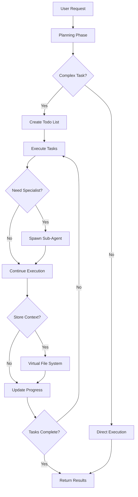

# AWS Agent (DeepAgent)

A LangGraph DeepAgent for autonomous AWS problem-solving, part of the Planton Cloud Agent Fleet.

## Overview

The AWS Agent is built using the [DeepAgents](https://github.com/langchain-ai/deepagents) framework, which enables it to autonomously plan and execute complex AWS tasks. Unlike simple conversational agents, this DeepAgent can break down problems, spawn specialized sub-agents, and maintain context across long-running operations.

## Project Structure

```
aws_agent/
├── __init__.py              # Package exports and imports
├── configuration.py         # Agent configuration and settings
├── state.py                # State management for conversations
├── graph.py                # Main agent orchestration
├── llm.py                  # LLM provider configuration
├── grpc_server.py          # gRPC service implementation
├── README.md               # This documentation
├── tools/                  # AWS-specific tools
│   ├── __init__.py
│   ├── credentials.py      # Credential management
│   ├── error_analysis.py   # Error diagnosis
│   └── architecture.py     # Architecture recommendations
└── subagents/              # Specialized sub-agents
    ├── __init__.py
    ├── ecs_troubleshooter.py
    ├── cost_optimizer.py
    └── security_auditor.py
```

## DeepAgent Architecture

### What Makes This a "Deep" Agent?

Based on LangChain's DeepAgents framework, our AWS agent implements four key capabilities:

1. **🎯 Planning Tool**
   - Breaks complex tasks into manageable todo items
   - Tracks progress and dependencies
   - Maintains focus on long-running operations

2. **🤖 Sub-Agents**
   - Spawns specialized agents for specific tasks:
     - `ecs_troubleshooter`: Deep dives into ECS issues
     - `cost_optimizer`: Analyzes and reduces AWS costs
     - `security_auditor`: Reviews security configurations
   - Each sub-agent has focused expertise and instructions

3. **📁 Virtual File System**
   - Stores investigation findings and intermediate results
   - Maintains context across multiple steps
   - Enables collaboration between sub-agents

4. **📜 Detailed System Prompt**
   - Comprehensive instructions with specific methodologies
   - Examples and best practices built-in
   - Guides autonomous problem-solving behavior

### Agent Flow



## Core Components

### 1. Configuration (`configuration.py`)
Enhanced configuration for DeepAgents:
- Planning enablement
- Sub-agent configuration
- Virtual file system settings
- Extended timeout for complex operations

### 2. State (`state.py`)
Maintains conversation and AWS context:
- AWS credentials and region
- Session management
- Error tracking
- Virtual file system state (via DeepAgents)

### 3. Graph (`graph.py`)
Main orchestration module that:
- Assembles tools and sub-agents
- Creates DeepAgent instances
- Manages configuration
- Provides factory functions

### 4. LLM Module (`llm.py`)
Handles language model configuration:
- Supports OpenAI and Anthropic models
- Model-specific settings
- Provider detection and fallbacks

### 5. Tools Package (`tools/`)
AWS-specific tools organized by function:
- **credentials.py**: `fetch_aws_credentials_tool` - Planton Cloud MCP integration
- **error_analysis.py**: `analyze_aws_error` - Intelligent error diagnosis
- **architecture.py**: `generate_aws_architecture` - Architecture recommendations

### 6. Sub-agents Package (`subagents/`)
Specialized sub-agents for deep expertise:
- **ecs_troubleshooter.py**: ECS service and container debugging
- **cost_optimizer.py**: Cost analysis and optimization
- **security_auditor.py**: Security and compliance auditing

## Usage Examples

### Basic Usage

```python
from agents.aws_agent import create_aws_agent
from langchain_core.messages import HumanMessage

# Create agent with DeepAgents capabilities
agent = await create_aws_agent()

# Complex task that will use planning
result = await agent.invoke({
    "messages": [HumanMessage(content="""
    My ECS service is failing to deploy. Tasks keep stopping with 
    'Essential container exited' error. Can you help me debug and fix this?
    """)],
    "aws_credential_id": "aws-cred-123"
})
```

### Observing Agent Planning

The agent will automatically:
1. Create a todo list for the debugging process
2. Fetch AWS credentials
3. Analyze the error
4. Potentially spawn the ECS troubleshooter sub-agent
5. Store findings in virtual file system
6. Provide step-by-step resolution

### Custom Configuration

```python
from agents.aws_agent import AWSAgentConfig

# Configure agent behavior
config = AWSAgentConfig(
    model_name="gpt-4o",
    temperature=0.3,
    enable_subagents=True,
    enable_planning=True,
    enable_file_system=True,
    max_steps=30  # Allow more steps for complex tasks
)

agent = await create_aws_agent(config=config)
```

### Working with Sub-Agents

Sub-agents are automatically spawned when needed:

```python
# This will likely spawn the cost_optimizer sub-agent
result = await agent.invoke({
    "messages": [HumanMessage(content="""
    Analyze my AWS account and find ways to reduce our $50k/month bill.
    Focus on EC2, RDS, and S3 optimizations.
    """)],
    "aws_credential_id": "aws-cred-123"
})
```

## Sub-Agent Specializations

### ECS Troubleshooter
- Task failure analysis
- Container exit debugging
- Service deployment issues
- Load balancer health checks
- Resource constraints

### Cost Optimizer
- Resource usage analysis
- Right-sizing recommendations
- Reserved Instance planning
- Unused resource identification
- Architecture cost optimization

### Security Auditor
- IAM policy reviews
- Security group analysis
- Encryption verification
- Compliance checking
- Best practice recommendations

## Virtual File System

The agent uses a virtual file system to:

```
/investigation/
  findings.md          # Key discoveries
  error_analysis.txt   # Detailed error breakdown
  recommendations.md   # Proposed solutions

/architecture/
  current_state.yaml   # Current architecture
  proposed_changes.md  # Recommended changes

/costs/
  analysis.csv        # Cost breakdown
  savings_plan.md     # Optimization strategy
```

## Advanced Features

### Planning Example

When given a complex task, the agent creates a todo list:

```
TODO List:
[ ] Fetch AWS credentials
[ ] Analyze ECS service configuration
[ ] Check CloudWatch logs for container exits
[ ] Review task definition for issues
[ ] Examine resource constraints
[ ] Test proposed fixes
[x] Document findings
```

### Context Persistence

The virtual file system maintains context:

```python
# First interaction
"Debug my ECS service deployment issues"
# Agent stores findings in virtual FS

# Later interaction  
"What were the main issues you found?"
# Agent retrieves context from virtual FS
```

### Autonomous Problem Solving

The agent can work autonomously on complex tasks:

```python
# This triggers multi-step autonomous work
"Perform a security audit of my AWS account and create a remediation plan"

# Agent will:
# 1. Plan the audit scope
# 2. Spawn security_auditor sub-agent
# 3. Store findings systematically
# 4. Create actionable remediation plan
```

## Integration with Planton Cloud

### Assistant Creation

Users create specialized assistants via:
- Web console with DeepAgent configuration
- Custom instructions for specific use cases
- Sub-agent selection and customization

### Execution Monitoring

Track agent progress through:
- Todo list updates
- Sub-agent spawning events
- Virtual file system changes
- Streaming progress updates

## Development

### Running with DeepAgents

```bash
# Install dependencies including deepagents
pip install deepagents langchain-openai

# Run example
python examples/aws_agent_example.py
```

### Testing Planning Behavior

```python
# Test complex task planning
agent = await create_aws_agent()
result = await agent.invoke({
    "messages": [HumanMessage(content="""
    1. Audit my S3 buckets for public access
    2. Review IAM policies for overly permissive access  
    3. Check EC2 instances for unencrypted volumes
    4. Create a security remediation plan
    """)],
    "aws_credential_id": "aws-cred-123"
})

# Observe todo list creation and systematic execution
```

## Limitations and Considerations

1. **Complexity vs Speed**: Deep agents take more time but provide thorough solutions
2. **Token Usage**: Planning and sub-agents increase token consumption
3. **State Management**: Virtual file system is ephemeral per session
4. **Sub-Agent Coordination**: Complex multi-agent scenarios need careful orchestration

## Future Enhancements

1. **Persistent File System**
   - Store findings across sessions
   - Build knowledge base over time

2. **Custom Sub-Agents**
   - User-defined specialist agents
   - Industry-specific agents (FinTech, HealthTech)

3. **Tool Integration**
   - Direct AWS SDK integration
   - CloudFormation/Terraform generation
   - Real-time AWS resource queries

4. **Collaborative Features**
   - Multi-agent collaboration
   - Human-in-the-loop approvals
   - Audit trails for compliance

## Troubleshooting

### Agent Not Planning
- Ensure `enable_planning=True` in config
- Check task complexity (simple tasks may not need planning)
- Verify model supports function calling

### Sub-Agents Not Spawning
- Confirm `enable_subagents=True`
- Check if task matches sub-agent specialization
- Review agent decision-making in logs

### Virtual FS Issues
- Ensure `enable_file_system=True`
- Check state persistence configuration
- Verify sufficient context window

## Contributing

To enhance the AWS DeepAgent:

1. **Add Sub-Agents**: Create new specialists in `graph.py`
2. **Extend Tools**: Add AWS-specific tools for common operations
3. **Improve Planning**: Enhance todo list strategies
4. **Document Patterns**: Share successful agent patterns

## License

Part of Planton Cloud Agent Fleet - see repository LICENSE file.